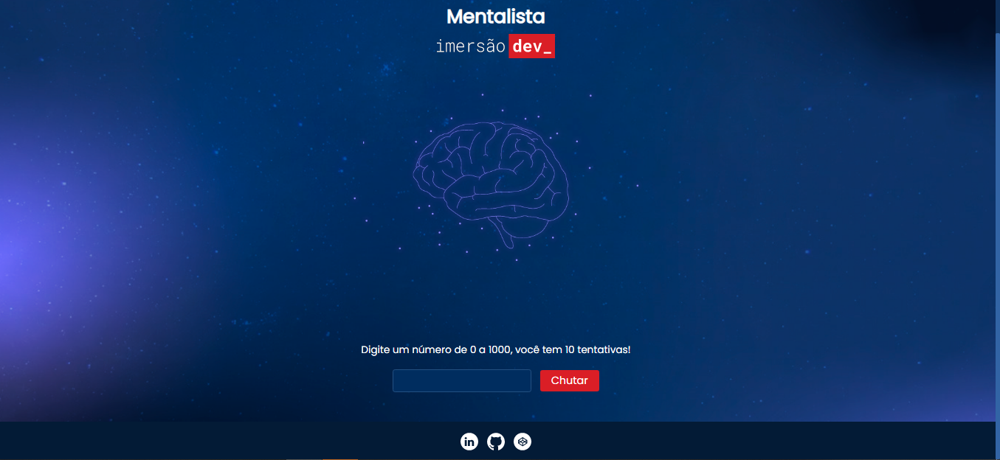

<h1 align="center"> ImersãoDev - Mentalista</h1>

A ImersãoDev da Alura consiste em 5 aulas gratuitas com grandes referências como Paulo Silveira, Rafaella Ballerini e Guilherme Lima, para criar um portfólio de programas incrível e começar a sua carreira em programação. 

  

---

## 💻 Projeto
Este projeto é  um jogo onde você tem que adivinhar o número secreto entre 0 a 1000, conforme o chute, irá aparecer uma mensagem dizendo se você acertou, errou ou é menor/maior.  
Em cada uma dessas ocasiões tem uma mensagem e um gif diferente, também há um limite de 10 tentativas.

---

## 🚀 Tecnologias

Esse projeto foi desenvolvido com as seguintes tecnologias:

- HTML e CSS
- JavaScript 